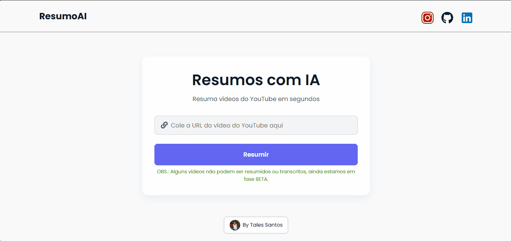

# ResumoAI

O **ResumoAI** é um projeto web que gera **transcrições automáticas** e **resumos organizados** de vídeos do YouTube.  
Basta colar o link do vídeo para obter rapidamente um resumo claro, estruturado e pronto para leitura.

O projeto combina **Node.js** no backend com **ReactJS** no frontend, utilizando a API do **[YouTube-Transcript](https://www.youtube-transcript.io/)** para extração de legendas e a API do **[Gemini](https://ai.google.dev/gemini-api/docs/api-key?hl=pt-br)** formatação do resumo.

## Visão geral

### Captura do projeto

#### Página inicial

#### Página de resumo

### Links

* URL do site ativo: **https://resumo-ai.vercel.app/**
  
## Sobre esse Projeto

• <strong>Transcrição automática</strong>: Extrai legendas de vídeos do YouTube automaticamente.  
• <strong>Resumo estruturado</strong>: Gera introdução, pontos principais e conclusão.  
• <strong>Uso de IA + consumo de API externa</strong>: O resumo é criado pela IA com base na transcrição obtida do YouTube Transcript.  
• <strong>Alternância de visualização</strong>: Permite visualizar resumo ou transcrição completa.  
• <strong>Player integrado</strong>: O vídeo é exibido diretamente na página de resultado.  
• <strong>Responsivo</strong>: Funciona bem em desktop e dispositivos móveis.  

> O projeto não depende exclusivamente da IA, apenas para a estruturação do resumo.

### Construído com

 

## Outros

### Observações

• Nem todos os vídeos possuem legendas disponíveis  
• Vídeos muito curtos podem gerar resumos incompletos  
• Projeto em fase <strong>BETA</strong>

### Minhas redes sociais

 
   
   
   
   

